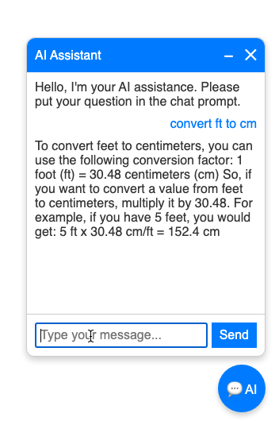

# AIChat

This repository provides a fully functional example of how to integrate an AI chatbot into your HTTP server using an HTML widget.

### ✨ Features

* Lightweight, portable HTML/JS widget
* Simple Go backend using `net/http`
* Connects to an [Ollama](https://ollama.com/) server for AI responses
* Easily customizable for your own models or use cases

---

### 📦 Requirements

* [Ollama](https://ollama.com/) server (for local AI model inference)
* Go compiler (≥ 1.18 recommended)

---

### 🚀 Build and Run

Follow these steps to set up and run the AI chat server:

```bash
# Step 1: Download and install the Ollama server
# Visit https://ollama.com/download and follow installation instructions

# Step 2: Pull an Ollama model (example: mistral)
ollama pull mistral

# Step 3: Run the Ollama model server
ollama run mistral

# Step 4: Build the HTTP server
go build

# Step 5: Run the AIChat server
./aichat

# Step 6: Open your browser and visit:
http://localhost:8080
```

---

### 💬 Screenshot


